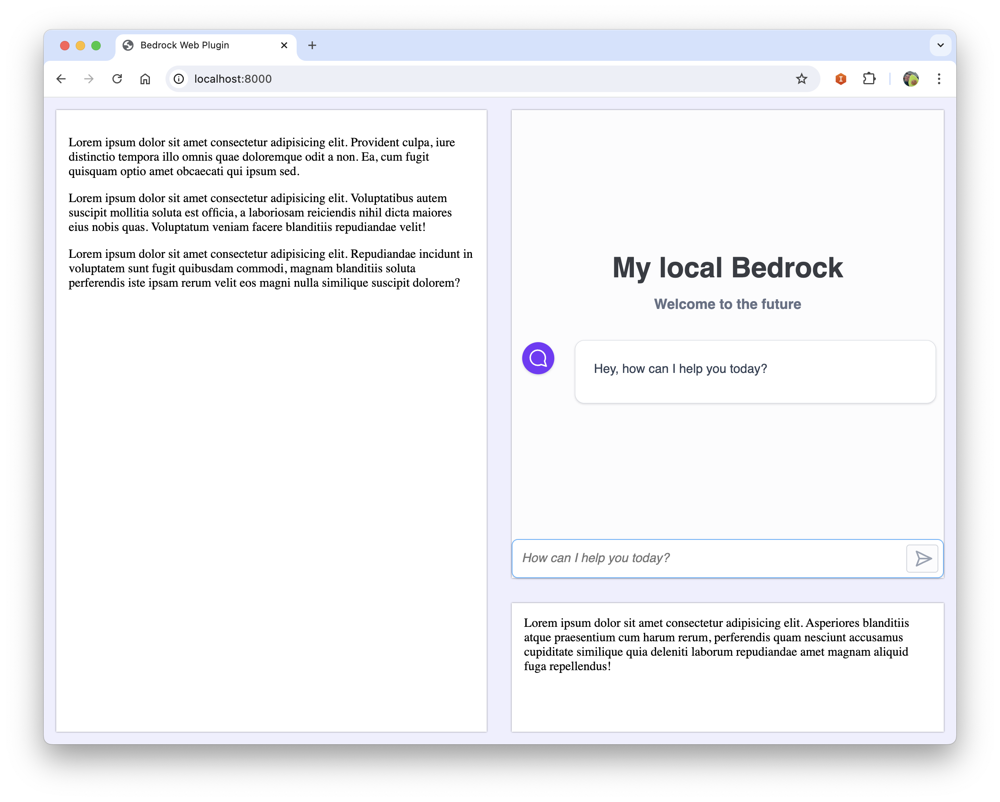
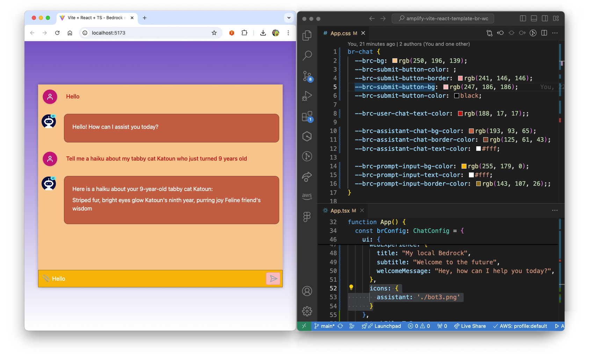

## Bedrock Webcomponent



https://github.com/user-attachments/assets/98d947f9-d724-4dfd-8f6e-62af0ffcdbd4


### Install
As of today, this webcomponent is not published on npm. You will have to build it yourself and link it to your project.  
Don't worry, this is easier than it looks :) 
- Download the source code and go in the folder
```bash
npm run build
npm link
```
Go in the project where you want to add the webcomponent
```bash
npm link br-chat-wc
```

You should now be able to use the webcomponent in your project.

### How To

To use the webcomponent, import it in your project.  
Note: Depending of the framework you are using, how you import it may differ
```javascript
import 'br-chat-wc';
```

You can then use it in your html file
```html
<br-chat config=""></br-chat>
```

You can also give an array of messages when initializing the chat

```html
<br-chat config="" messages=""></br-chat>
```

> [!IMPORTANT]
> The messages is an array of messages following the [Amazon Bedrock conversation API](https://docs.aws.amazon.com/bedrock/latest/userguide/conversation-inference.html)

### Configuration

```javascript

import { ChatConfig } from 'br-chat-wc';

...

brConfig: ChatConfig  = {
    auth: {
        region: "us-west-2",
        identityPoolId: "",
        anonymous: {
            roleArn: ""
        },
        // cognito: {
        //   userPoolId: ""
        // },
    },
    bedrock: {
        region: "us-west-2",
        modelId: "anthropic.claude-3-sonnet-20240229-v1:0",
        // agent: {
        //   agentId: "",
        //   agentAliasId: ""
        // },
        inferenceConfig: { // (optional)
            maxTokens: 600,
            temperature: 0.5,
            topP: 1
        }
    },
    ui: { // (optional)
        webExperience: {
            title: "My local Bedrock",
            subtitle: "Welcome to the future",
            welcomeMessage: "Hey, how can I help you today?",
        },
        icons: {
          assistant: 'assets/assistant.png',
          user: 'assets/user.png'
        },
        placeholder: "Hi, how can I help you?"
    },
    attachFilesToPrompt: true // (optional)
  }
```
#### Auth
There are 2 ways to access Bedrock with the webcomponent:  
You may want to give access to Bedrock to non-authenticated users:
- Set the `auth.anonymous.roleArn` of your UnauthenticatedRole  

If you want to give access to Bedrock to authenticated users
- Set the `auth.cognito.userPoolId`

#### Bedrock
There are 2 ways to connect the plugin to Bedrock:
- By calling a model
Simply set the `bedrock.modelId` parameter in the plugin to specify which model you want to call
- By calling a Bedrock Agent
Specify the `bedrock.agent` parameter with the `agentId` and `agentAliasId`

#### UI

##### Icons
We give you the option to configure some of the UI
- Change the chat icons:
You can change the icons of the user and assistant by setting the `ui.icons` specifying a path of the image for the `assistant` and the `user`  

##### Welcome message
You can customize the welcome screen if you want to greet your users with a specific message by using the `ui.webExperience` configuration. You can specify a `title`, `subtitle` and `welcomeMessage`.
This welcome screen will disapear as soon as the user starts a discussion.

##### Theme/CSS
You can also customize a number of css attributes through css variables to make the webcomponent match your onwn branding/theme

Here is a list of css variables you can custom:
```css
--brc-primary: ;
--brc-bg: ;
--brc-text-color: ;
--brc--text-invert-color: ;

--brc-submit-button-color: ;
--brc-submit-button-border: ;
--brc-submit-button-bg: ;
--brc-submit-button-color: ;
--brc-submit-button-bg-hover: ;

--brc-user-chat-text-color: ;

--brc-assistant-chat-bg-color: ;
--brc-assistant-chat-border-color: ;
--brc-assistant-chat-text-color: ;

--brc-prompt-input-bg-color: ;
--brc-prompt-input-text-color: ;
--brc-prompt-input-border-color: ;
```

Your imagination is the limit ^^




### Events

Every time a new message is added to the chat, a `brc-messages-updated` event is sent.  
You can easily listen to this event and retrieve the array of all the messages of the chat. This can be useful if for example you want to send the messages to a server to store them in a database

```javascript
const chatComponent = document.querySelector('br-chat');

chatComponent.addEventListener('brc-messages-updated', (event) => {
    console.log('Messages array updated:', event.detail.messages);
    // Handle the updated messages array here
});
```

### Use it in your favourite framework

#### React
In your React component:
```javascript
import "br-chat-wc";
import { ChatConfig } from 'br-chat-wc';
```

Create a new variable for the configuration in your React component ts file
```javascript
const brConfig: ChatConfig = {
    auth: {
      region: "us-west-2",
    
      ...
    }
}
```

Use the webcomponent in your React component template
```html
<br-chat config={JSON.stringify(brConfig)}></br-chat>
```

#### Angular
In your `main.ts` file:
```javascript
import 'br-chat-wc';
```

Import the configuration type in your Angular component
```javascript
import { ChatConfig } from 'br-chat-wc';
```

Create a new variable for the configuration in your Angular component ts file
```javascript
brConfig: ChatConfig = {
    auth: {
      region: "us-west-2",
    
      ...
    }
}
```

Use the component in your Angular component html template
```html
<br-chat [config]="brConfig"></br-chat>
```


#### Use it with AWS Amplify and Cognito
If you are using <a href="https://aws.amazon.com/amplify/" target="_blank">AWS Amplify</a> for your app and Amazon Cognito to authenticate your users, here is how you can integrate the webcomponent in a React App using Amplify and Cognito.  

In your React component, import the amplify_outputs.json file
```javascript
import amplifyConfig from "../amplify_outputs.json";
```

In the config object you pass to the web component, remplate the `auth` property by
```javascript
const brConfig: ChatConfig = {
    auth: {
        region: amplifyConfig.auth.aws_region,
        identityPoolId: amplifyConfig.auth.identity_pool_id,
        cognito: {
            userPoolId: amplifyConfig.auth.user_pool_client_id
        },
    },
    bedrock: {
        region: "us-west-2",
        modelId: "anthropic.claude-3-sonnet-20240229-v1:0",
    },
    ui: {
        webExperience: {
            title: "My local Bedrock",
            subtitle: "Welcome to the future",
            welcomeMessage: "Hey, how can I help you today?",
        },
    }
};
```
